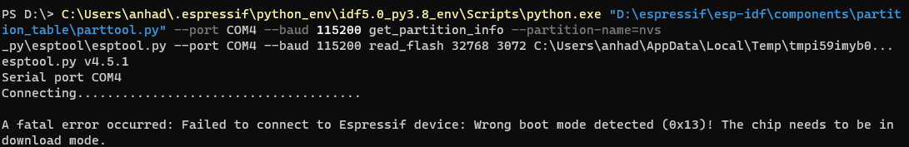

     

This is the entire codebase of a hardware-focused project made as a part of the [2023 Arduino Hackathon](https://www.facebook.com/events/165398366306829/) hosted by UQ Mars, RoboGals & QUT Robotics Club. The theme of the hackathon was **automation**, with our project following that by attempting to automate logins with RFID technology.

The main purpose of this application is to act as a password and RFID card manager, with a front-end application where you're able to manage your RFID cards and a back-end that talks with an ESP32 via Rust to load binaries based on what you are doing on the front-end. The project was not presented at the event but we did end up completing it afterwards. We have draft mock-ups in the `concept.excalidraw` file on root.

Please refer to the [User Guide](UserGuide.md) for how to use this program. 

This project was limited by scarce parts and limited ESP32 documentation, findings will be listed below. 

## Stack
- [NextJS](https://nextjs.org/), our chosen ReactJS front-end framework. 
- [Tauri](https://tauri.app), a framework that allowed us to create a web-based application with our chosen front-end. Tauri combines the front-end and back-end to communicate with the ESP32 hardware back-end.
- ESP32 / Arduino hardware stack
- RFID scanner (RC522) component - currently limited to MiFare


## Troubleshooting
### Wrong Boot Mode on ESP32


This error requires the user to hold down the boot button. The fix is to install a 10uF capacitor between EN and ground on your hardware configuration. (This is a bypass cap therefore needs to be placed positive lead at en). Another option is while holding the EN button, connect the USB cable. Hold it down for longer before connecting if still doesnt work.

This seems to only have been encountered on my laptop regardless of if its running windows, or manjaro linux. This was tested with an esp32-wroom and an esp32s2 mini.

This seems to be a common issue relating to inconsistency in some ESP modules where the RC delay on the EN signal is not sufficient which breaks the timing.

**Related Articles**
- [Reddit thread](https://old.reddit.com/r/esp32/comments/1090drj/failed_to_connect_to_esp32_wrong_boot_mode/)
- [GitHub issue](https://github.com/espressif/esptool/issues/741)

### Limitations
**ESP32 USB Output**
- The base model of the ESP32 does not have an in-built USB controller but the ESP32-S2/S3, in the project's current state it only supports keyboard output via Bluetooth. This means that you will have to connect the ESP32 to your computer via Bluetooth before you can use the program. 

**Password Encryption**
- Currently passwords are not encrypted and are instead stored on the partition in a way that if someone was reading off your ESP32's partition they would be able to obtain the passwords that you synced to the device.

#### Pn532
The Pn532 is a very versatile chip however it is slightly more expensive in mass and uses more power. 
Total power used when using chips
- RC522: ~24mA
- PN532: ~95mA

## Development
### Process for Building ESP32 Binaries 
1. Run `git pull --recurse-submodules` to pull the esp-idf repository
2. **(Optional)** Run `pyi-makespec .esp-idf/components/partition_table/parttool.py` and replace the name of the python file
    - Create a merged file that merges all the commands into collect like seen in `merged.spec`, see `https://www.zacoding.com/en/post/pyinstaller-create-multiple-executables/` or https://pyinstaller.org/en/stable/spec-files.html#multipackage-bundles
3. Run `bash pyinstaller --distpath ./dist single_merged.spec`
4. Download the esptool binary for your OS from the [GitHub repo](https://github.com/espressif/esptool) under releases and drag it into the `src-tauri\bin\dist` folder
5. Rename folder to match the OS tag, which includes running `rustc -Vv | grep host | cut -f2 -d' '` to get the host tag. See [here](https://tauri.app/v1/guides/building/sidecar/) for more details.
- The executables need to be in the same folder otherwise you end up with error

	```
	[55752] Archive not found: D:\keyDOTboard\src-tauri\bin\merged_dist\parttool-x86_64-pc-windows-msv
	```

### ESP binary configuration
- Have to use pin 17(TX), 18(RX) for debug printing wehn using a HID device
	- To see how to connect a usb serial cable see this [link](https://www.jeffgeerling.com/blog/2021/attaching-raspberry-pis-serial-console-uart-debugging)
- assign these through uart1 in esp config, https://docs.espressif.com/projects/esp-idf/en/latest/esp32s2/get-started/linux-macos-setup.html#console-output-configuration
- manually change these pins in the menuconfig
- Do note that if an ESP_ERROR_CHECK is thrown the esp will reset/reboot so do not be alarmed

## Wiring layout for pushbutton 
- It is better to use a pullup configuration for the pushbutton. Meaning it will output 1 normally, when pulled down to ground, it will output 0. (This is because the ESP32 has an internal pullup resistor that has been enabled). [link](https://esp32.com/viewtopic.php?t=6478)
- This is better so that you dont export V_BUS out and so it doesnt get shorted to ground crashing your board.

- The opposite way this can be enabled is for 3.3v to go into the GPIO port https://randomnerdtutorials.com/esp32-digital-inputs-outputs-arduino/
- https://forum.arduino.cc/t/pull-up-or-pull-down-resistors-on-esp32/921334/2

###  Learns with wiring
- One thing I learnt the hard way by killing an esp32-s2 mini (-$5) is to isolate your breadboard to 1 project at a time. There was current going back into the old esp that was there because of the power rails. Luckily second time I had a usb power meter the second time.

### Rust learns 
#### Rust Serial Port


## References
- [**Inspiration**](https://github.com/Jaycar-Electronics/RFID-Computer-Login)
- Icons from [**SVG REPO**](https://www.svgrepo.com/)

## TODO
- [x] Rewrite create to be the only screen that subscribes to the rfid alert
- [x] Send Newcard struct
- [ ] error handling to handle disconnect
- [x] Tune keyboard timings
- [ ] BIG EPIC BUTTON
	- Hold down key, while held down keep sending spaces bars and stuff
	- On release send the actual password
- [ ] Indicator Leds
- [ ] Solder onto perf board


- [ ] rewrite load binary page to function as a way to load the first time binary.
	- [ ] Add port selection
	- [ ] Load binary
	- [ ] Reset NVS on this page in case somethign went horribly wrong, we can make this two options, using partool or just doing it through payload
	